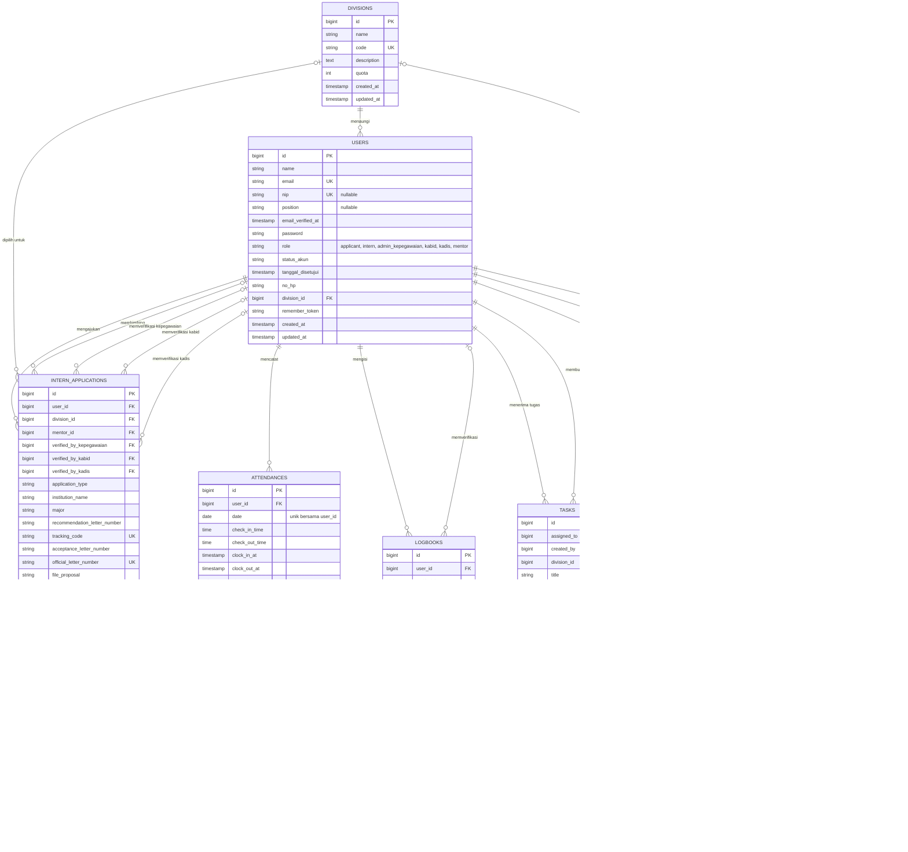
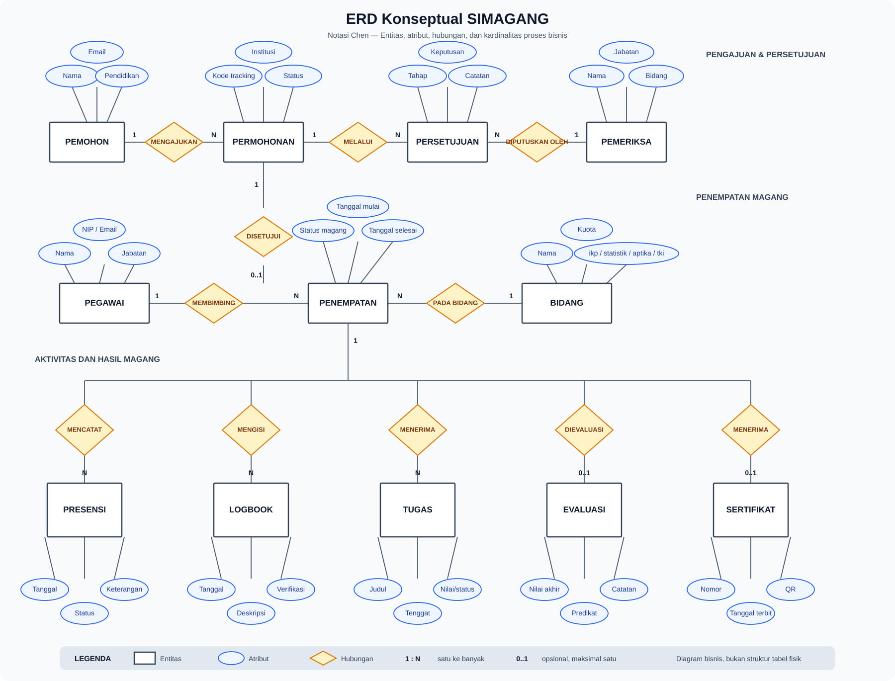

# ERD SIMAGANG

ERD ini merangkum skema domain SIMAGANG berdasarkan migrasi database proyek saat ini. Tabel infrastruktur Laravel seperti `migrations`, `sessions`, `cache`, `jobs`, dan `personal_access_tokens` tidak ditampilkan agar fokus pada proses bisnis magang.

## Metode Agile yang disarankan

ERD dikembangkan dan ditinjau secara bertahap bersama Product Owner/pengguna. Setiap iterasi menghasilkan bagian skema yang dapat divalidasi terhadap alur aplikasi, bukan menunggu seluruh sistem selesai.

| Iterasi | Product backlog / hasil | Kriteria penerimaan |
|---|---|---|
| Sprint 1 — Fondasi akun dan bidang | `USERS`, `DIVISIONS` | Peran pengguna, status akun, bidang, dan kuota sesuai proses registrasi dan pengelolaan bidang. |
| Sprint 2 — Pengajuan dan persetujuan | `INTERN_APPLICATIONS` serta relasi ke pengguna, bidang, mentor, dan verifikator | Alur pelacakan dan persetujuan Kepegawaian, Kabid, serta Kadis dapat ditelusuri dari relasi dan status yang tersimpan. |
| Sprint 3 — Aktivitas magang | `ATTENDANCES`, `LOGBOOKS`, `TASKS` | Peserta dapat mencatat presensi, mengisi logbook, dan menerima/mengumpulkan tugas; mentor dapat meninjau aktivitas. |
| Sprint 4 — Evaluasi dan keluaran | `EVALUATIONS`, `CERTIFICATES` | Evaluasi mengacu pada peserta dan mentor, serta sertifikat terhubung dengan peserta yang menerimanya. |
| Review dan iterasi | Tinjau diagram, istilah, kardinalitas, dan kebutuhan baru bersama pemangku kepentingan | Perubahan disepakati dan diagram diperbarui sebelum perubahan skema database diterapkan. |

### Catatan relasi

- Master `DIVISIONS` disediakan dinamis melalui API. Seeder saat ini memastikan empat kode: `ikp`, `statistik`, `aptika`, dan `tki`; Kabid/mentor ditautkan dengan `division_id`.
- `USERS.nip` bersifat unik dan nullable agar akun non-pegawai serta akun lama tetap kompatibel; `position` menyimpan jabatan pegawai dan nullable.
- Presensi dan logbook saat ini terhubung langsung ke `users`, bukan ke `intern_applications`.
- Verifikator persetujuan dan mentor disimpan sebagai relasi ke `users`.
- `ATTENDANCES` memiliki batasan unik gabungan pada `user_id` dan `date`.
- Notasi `o|` menunjukkan relasi opsional karena foreign key terkait nullable; `||--o{` menunjukkan satu induk dapat memiliki banyak data turunan.
- Diagram ini menggambarkan struktur yang sudah ada pada migrasi, bukan usulan perubahan database.

## ERD Konseptual Proses Bisnis

Diagram konseptual berikut memakai notasi Chen: persegi panjang untuk entitas, oval untuk atribut, berlian untuk hubungan, dan angka `1`/`N` untuk kardinalitas. Buka gambar langsung atau tampilkan Markdown Preview dengan **Ctrl+Shift+V**.

### Batasan diagram konseptual

- Satu permohonan dapat melewati beberapa tahap persetujuan; diagram tidak membatasi jumlah pemeriksa atau tahapan pada implementasi tertentu.
- Penempatan hanya terbentuk setelah permohonan diterima dan menghubungkan peserta, bidang, serta pembimbing dalam konteks satu kegiatan magang.
- Presensi, logbook, tugas, evaluasi, dan sertifikat diletakkan di bawah penempatan untuk menunjukkan keterkaitan proses bisnis. Implementasi database saat ini menghubungkan beberapa data aktivitas langsung ke akun pengguna.
