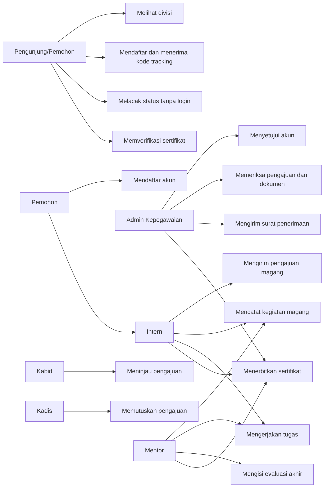

# Use Case SIMAGANG

## Tujuan sistem

SIMAGANG mengelola proses magang mulai dari pendaftaran peserta dan seleksi pengajuan, pemantauan kegiatan magang, penilaian, hingga penerbitan dan verifikasi sertifikat. Dokumen ini disusun berdasarkan endpoint dan aturan yang tersedia pada backend saat ini.

## Aktor

| Aktor | Tanggung jawab |
|---|---|
| Pengunjung/Pemohon | Melihat daftar divisi, mendaftar, melacak status menggunakan kode tracking, dan memeriksa keabsahan sertifikat. |
| Pemohon | Mendaftar; status pengajuan dapat dilacak tanpa login menggunakan kode tracking yang diterima saat pendaftaran. Akun diaktifkan setelah surat penerimaan diterbitkan. |
| Intern | Mengajukan magang, melihat surat penerimaan, melakukan presensi, mengisi logbook, mengerjakan tugas, melihat evaluasi, dan mengambil data sertifikat. |
| Admin Kepegawaian | Menyetujui akun pemohon, memeriksa dokumen dan pengajuan, menentukan divisi, serta mengunggah surat penerimaan. Dapat memverifikasi logbook dan menerbitkan sertifikat. |
| Kepala Bidang (Kabid) | Meninjau pengajuan pada tahap bidang dan meneruskan ke Kadis atau menolak. |
| Kepala Dinas (Kadis) | Memberi keputusan akhir atas pengajuan: menyetujui atau menolak. |
| Mentor | Membuat tugas, mengelola statusnya, memverifikasi logbook dan presensi, melihat data peserta terkait, mengisi evaluasi akhir, dan menerbitkan sertifikat. |

## Master divisi

Pilihan divisi dan kuotanya bersumber dari endpoint publik `GET /api/divisions`, bukan daftar statis di formulir atau halaman publik. Master saat ini memuat:

| Kode | Bidang |
|---|---|
| `ikp` | Bidang Informasi dan Komunikasi Publik (IKP) |
| `statistik` | Bidang Statistik |
| `aptika` | Bidang Aplikasi Informatika |
| `tki` | Bidang Telekomunikasi dan Keamanan Informasi |

Setiap Kabid dan mentor ditautkan ke divisi melalui `division_id`. Kepegawaian memilih divisi dan memeriksa sisa kuota; antrean pengajuan Kabid serta daftar mentor yang dapat ditugaskan dibatasi pada divisi pengajuan tersebut.

## Diagram ringkas

## Daftar use case

| ID | Use case | Aktor utama | Hasil |
|---|---|---|---|
| UC-01 | Melihat daftar divisi | Pengunjung, semua pengguna | Daftar divisi dan informasi kuota tersedia. |
| UC-02 | Mendaftar akun | Pemohon | Akun dibuat dengan status menunggu persetujuan. |
| UC-03 | Menyetujui akun pemohon | Admin Kepegawaian, Kadis | Akun pemohon diaktifkan sebagai Intern. |
| UC-04 | Login dan mengelola sesi | Semua pengguna terdaftar | Pengguna memperoleh token, melihat profil, atau mengakhiri sesi. |
| UC-05 | Mendaftar pengajuan magang | Pemohon | Pengajuan beserta dokumen tercatat dan kode tracking diberikan kepada pemohon. |
| UC-06 | Memeriksa dan memutuskan pengajuan | Admin Kepegawaian, Kabid, Kadis | Pengajuan diteruskan antar tahap atau ditolak. |
| UC-07 | Menerbitkan surat penerimaan | Admin Kepegawaian | Nomor dan PDF surat diterbitkan; status menjadi diterima dan tautan unduhan publik tersedia. Email dikirim bila layanan email aktif. |
| UC-08 | Melakukan presensi | Intern | Check-in hadir/sakit/izin tercatat dengan bukti sesuai ketentuan dan menunggu persetujuan mentor. |
| UC-09 | Mengelola logbook | Intern, Mentor, Admin Kepegawaian | Intern mengirim kegiatan; Mentor atau Admin memverifikasi. |
| UC-10 | Mengelola tugas magang | Mentor, Intern | Mentor membuat dan mengatur status tugas; Intern memperbarui progres serta mengirim hasil tanpa nilai per tugas. |
| UC-11 | Melihat ringkasan presensi | Intern, Mentor | Ringkasan kehadiran ditampilkan untuk peserta yang dapat diakses. |
| UC-12 | Membuat evaluasi akhir | Mentor | Evaluasi tersimpan dengan skor akhir hasil perhitungan sistem. |
| UC-13 | Menerbitkan dan melihat sertifikat | Mentor, Admin Kepegawaian, Intern | Sertifikat digital diterbitkan setelah magang selesai dan evaluasi tersedia, lalu dapat dilihat Intern. |
| UC-14 | Memverifikasi sertifikat | Pengunjung | Keabsahan sertifikat dan ringkasan informasinya ditampilkan menggunakan kode QR/hash. |
| UC-15 | Melacak status pengajuan | Pemohon | Status pengajuan dilihat secara publik menggunakan kode tracking pribadi; surat penerimaan tersedia setelah diterbitkan. |

## Spesifikasi use case utama

### UC-02 — Mendaftar akun

- **Aktor:** Pemohon.
- **Prasyarat:** Email belum digunakan.
- **Pemicu:** Pemohon mengirim formulir pendaftaran.
- **Alur utama:**
  1. Pemohon mengisi nama, email, kata sandi, dan nomor telepon opsional.
  2. Sistem memvalidasi data dan membuat akun dengan status `pending`.
  3. Sistem memberi tahu bahwa akun perlu disetujui sebelum dapat digunakan.
- **Alur alternatif:** Jika data tidak valid atau email telah digunakan, sistem menolak pendaftaran dan mengembalikan kesalahan validasi.
- **Pascakondisi:** Akun menunggu persetujuan Admin Kepegawaian.

### UC-05/UC-06 — Mengajukan dan memproses magang

- **Aktor:** Intern, Admin Kepegawaian, Kabid, Kadis.
- **Prasyarat:** Pemohon memiliki dokumen pendaftaran dan belum menggunakan email yang terdaftar.
- **Pemicu:** Intern mengirim pengajuan magang.
- **Alur utama:**
  1. Pemohon memuat pilihan bidang dari master divisi, lalu mengisi data pribadi, kode bidang, institusi, jurusan, periode magang, kata sandi, dan dokumen `b1`–`b4`.
  2. Sistem memvalidasi data, membuat akun pemohon serta pengajuan, lalu mengembalikan kode tracking.
  3. Sistem memastikan kode bidang terdaftar dan kuota divisi masih tersedia.
  4. Admin Kepegawaian memeriksa kelengkapan berkas, menetapkan `division_id`, dan meneruskan pengajuan.
  5. Kabid pada divisi tersebut meninjau kesesuaian teknis, memilih Kabid/mentor aktif dari divisi yang sama, lalu meneruskan pengajuan ke Kadis.
  6. Kadis hanya memberi otorisasi atau menolak. Persetujuan mengubah status menjadi `approved_by_kadis`.
  7. Admin Kepegawaian mengisi `official_letter_number` dan mengunggah PDF surat melalui `issue-letter`.
  8. Sistem mengaktifkan akun dan mengubah status menjadi `accepted`; email dikirim bila layanan email aktif dan pemohon dapat mengunduh surat langsung dari tautan tracking publik.
- **Alur alternatif:** Kepegawaian, Kabid, atau Kadis dapat menolak pada tahap kewenangannya; alasan penolakan dapat dilihat oleh pemohon yang menggunakan kode tracking.
- **Alur alternatif:** Jika kode divisi tidak valid atau kuota habis, sistem menolak pendaftaran atau transisi persetujuan tanpa mengubah penempatan. Kabid tidak dapat melihat pengajuan atau memilih mentor dari divisi lain.
- **Pascakondisi:** Pengajuan berstatus ditolak atau diterima dengan nomor dan surat resmi terbit.

### UC-15 — Melacak status pengajuan

- **Aktor:** Pemohon.
- **Prasyarat:** Pemohon memiliki kode tracking dari respons pendaftaran.
- **Alur utama:** Pemohon membuka pelacak, memasukkan kode, lalu sistem mengembalikan status dan tahap penolakan (jika ada). Setelah status `accepted`, tautan surat bertanda tangan tersedia untuk unduhan tanpa login.
- **Alur alternatif:** Kode tidak ditemukan; sistem mengembalikan HTTP 404 dengan pesan agar pemohon memeriksa kembali kode.
- **Pascakondisi:** Pemohon hanya melihat payload pelacakan milik kode yang dimasukkan.

### UC-08 — Melakukan presensi

- **Aktor:** Intern.
- **Prasyarat:** Intern login dan memiliki akses ke proses magang.
- **Alur utama:**
  1. Intern memeriksa presensi hari ini.
  2. Untuk hadir, Intern mengambil swafoto melalui kamera langsung dan mengirim koordinat GPS.
  3. Sistem memvalidasi jarak Haversine terhadap koordinat kantor pada radius yang dikonfigurasi, menyimpan timestamp server, lalu mengirim catatan berstatus `pending_approval`.
  4. Untuk sakit/izin, Intern wajib melampirkan surat keterangan dokter/surat izin tanpa mengunggah swafoto hadir.
  5. Mentor satu divisi memeriksa bukti, lokasi, waktu, serta dokumen dan menyetujui atau menolak presensi.
  6. Intern melakukan check-out; waktu pulang juga dicatat oleh server.
- **Alur alternatif:** Sistem menolak hadir tanpa foto kamera, koordinat, konfigurasi lokasi kantor, atau jika berada di luar radius. Sistem menolak sakit/izin tanpa dokumen wajib.
- **Pascakondisi:** Catatan presensi menunggu atau memiliki keputusan mentor; hanya presensi hadir yang disetujui dihitung pada ringkasan kehadiran.

### UC-09 — Mengelola logbook

- **Aktor:** Intern; Mentor atau Admin Kepegawaian sebagai pemeriksa.
- **Prasyarat:** Intern login.
- **Alur utama:**
  1. Intern mengisi tanggal kegiatan dan deskripsi kegiatan, serta melampirkan berkas bila diperlukan.
  2. Sistem menyimpan entri logbook.
  3. Mentor atau Admin Kepegawaian memeriksa entri dan menetapkan disetujui atau ditolak, dengan catatan opsional.
- **Alur alternatif:** Sistem menolak tanggal di masa depan, deskripsi yang terlalu singkat, atau lampiran yang tidak memenuhi ketentuan.
- **Pascakondisi:** Status verifikasi logbook dapat dilihat pada daftar logbook.

### UC-10 — Mengelola tugas magang

- **Aktor:** Mentor dan Intern.
- **Prasyarat:** Kedua aktor login; Mentor memiliki kewenangan pada tugas terkait.
- **Alur utama:**
  1. Mentor membuat tugas dan menetapkan Intern yang mengerjakan.
  2. Intern melihat tugas, memperbarui status pengerjaan, serta mengirim catatan atau berkas hasil.
  3. Mentor memperbarui status menjadi `revision_needed` jika memerlukan revisi.
- **Alur alternatif:** Sistem menolak status yang tidak berlaku atau status `completed` tanpa catatan/file hasil.
- **Pascakondisi:** Status tugas tersimpan sebagai `pending`, `in_progress`, `revision_needed`, atau `completed`; tugas tidak memiliki nilai numerik individual.

### UC-12/UC-13/UC-14 — Evaluasi dan sertifikat

- **Aktor:** Mentor, Admin Kepegawaian, Intern, Pengunjung.
- **Prasyarat:** Intern memiliki pengajuan diterima dan kegiatan magangnya telah selesai.
- **Alur utama:**
  1. Mentor melihat counter status tugas dan persentase kelengkapan logbook, lalu mengisi skor disiplin, kualitas kerja, inisiatif, dan kerja sama (skala 1–100) setelah periode magang berakhir.
  2. Sistem menghitung nilai akhir sebagai rata-rata empat skor rubrik, menetapkan predikat, menyimpan catatan evaluasi, dan menandai magang selesai.
  3. Mentor atau Admin Kepegawaian menerbitkan sertifikat digital bagi Intern yang memenuhi syarat evaluasi.
  4. Intern melihat sertifikatnya; pihak lain dapat memeriksa keabsahan sertifikat menggunakan hash QR publik.
- **Alur alternatif:** Sistem menolak penerbitan jika magang belum selesai atau evaluasi akhir belum tersedia.
- **Pascakondisi:** Sertifikat tersimpan dan dapat diverifikasi secara publik.

## Aturan akses umum

- Pengguna harus login dengan token untuk mengakses sebagian besar fitur operasional.
- Tindakan dibatasi berdasarkan peran dan relasi pengguna; misalnya Intern hanya mengakses pengajuan dan data miliknya.
- Pengunjung/pemohon dapat mengakses daftar divisi, pendaftaran, pelacakan dengan kode tracking, unduhan surat melalui URL bertanda tangan, dan endpoint verifikasi sertifikat tanpa login.
- Kesalahan validasi menghentikan proses dan dikembalikan kepada klien API untuk diperbaiki.

## Cakupan dokumen

Dokumen ini menggambarkan use case backend yang sudah tersedia. Antarmuka pengguna, notifikasi selain email surat penerimaan, serta proses bisnis yang belum diimplementasikan pada endpoint tidak diasumsikan sebagai fitur.
